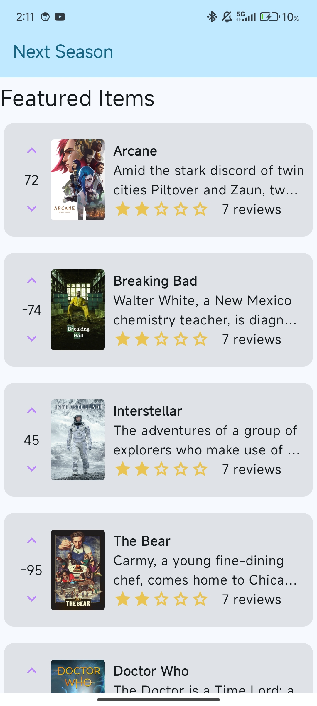
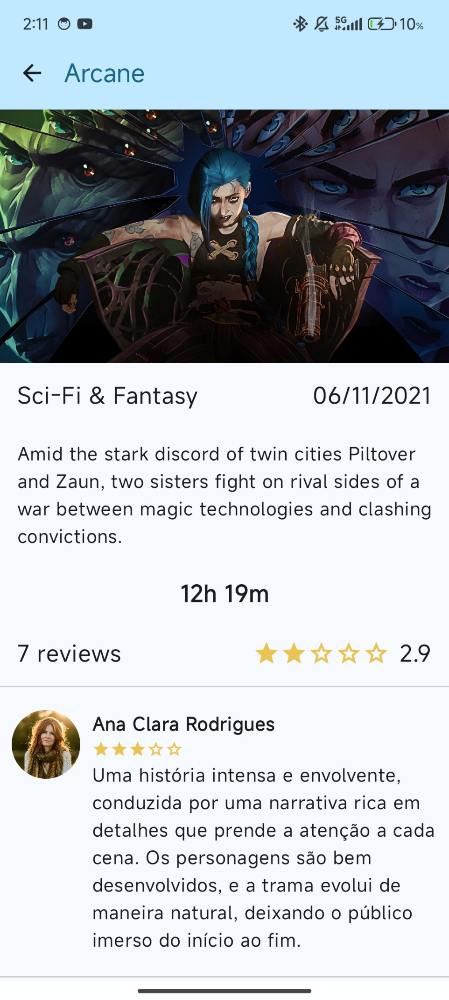
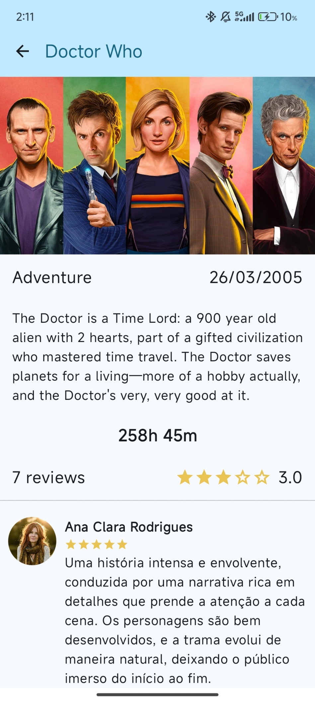
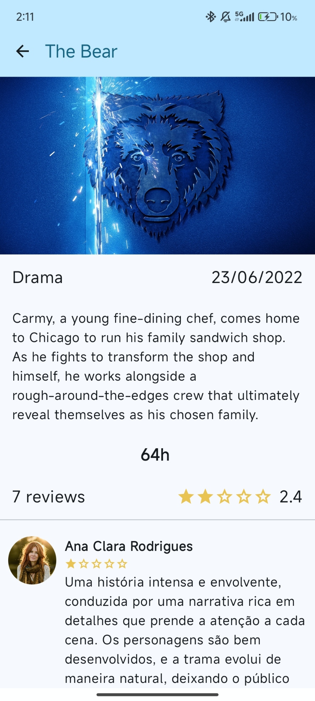

# Tarefa da Faculdade - Next Season

## Universidade Europeia / IADE - Engenharia Informática
Este repositório contém a tarefa do projeto desenvolvido em aulas, denominado **Next Season**, do curso de **Programação de Dispositivos Móveis**, parte do segundo ano (3º semestre) do curso de **Engenharia Informática**.

### Descrição da Tarefa
Nesta tarefa, o objetivo é criar uma nova **Activity** em um aplicativo Android utilizando **Jetpack Compose** e **Kotlin**. Abaixo estão os requisitos para a criação dessa nova tela:

- **Criação de uma nova Activity** chamada **ContentDetailActivity**.
- A **Activity** deve exibir informações detalhadas sobre filmes ou séries, com base nos dados recebidos da **MainActivity**.
- O layout da nova tela deve ser feito utilizando **Jetpack Compose**.
- Organizar todos os **componentes do UI** em arquivos separados e utilizar **previews individuais** para cada componente.
- Criar um modelo **User** para armazenar as informações relacionadas às reviews dos filmes ou séries.
- Utilizar dados de exemplo, incluindo **pelo menos 3 filmes ou séries**, com **5 reviews** para cada um.
- Imagens podem ser armazenadas localmente ou, se preferir, pode-se implementar uma funcionalidade para **baixar imagens automaticamente da internet**.
- O aplicativo deve ser funcional no **emulador Android**, sem crashes ou exceções fatais.

### Imagens de Exemplo

### Observações

Esta é a **primeira tarefa** deste repositório. Outras tarefas serão adicionadas conforme o progresso do curso, e este repositório será atualizado conforme necessário.