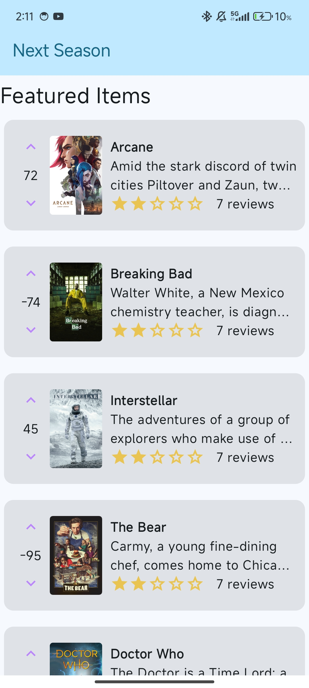
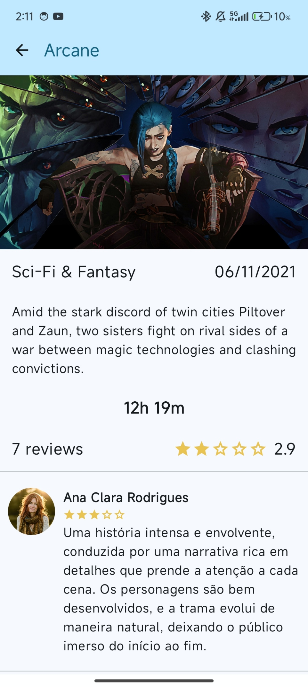
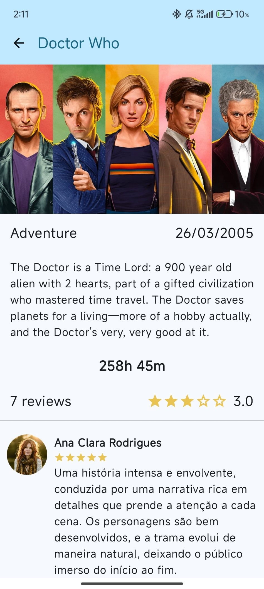
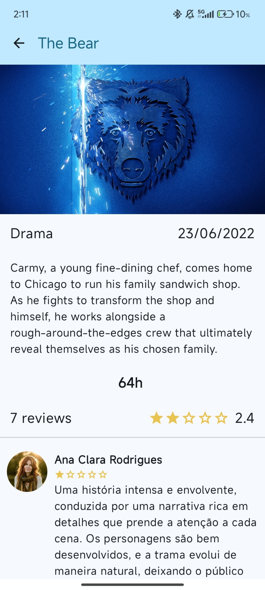

# Next Season

Um aplicativo de descoberta e avaliação de conteúdos (filmes/séries) desenvolvido com Jetpack Compose para Android.

[](LICENSE)


[](https://kotlinlang.org/)
[](https://developer.android.com/)
[](https://developer.android.com/jetpack/compose)

[English](README.md) | Portuguese

## Sobre

Next Season é um aplicativo móvel desenvolvido como parte da disciplina de Programação de Dispositivos Móveis no IADE - Engenharia Informática (Universidade Europeia). O aplicativo permite aos utilizadores navegar por uma lista de filmes ou séries, visualizar informações detalhadas sobre cada título e consultar avaliações de outros utilizadores.

A implementação foca-se nas práticas modernas de desenvolvimento Android utilizando **Jetpack Compose** para uma UI declarativa e **Kotlin** para uma lógica de aplicação robusta.

## Funcionalidades

- **Navegação de Conteúdos**: Explore um catálogo de filmes e séries.
- **Vistas Detalhadas**: Visualize informações ricas sobre cada título, incluindo descrição, género e data de lançamento.
- **Avaliações de Utilizadores**: Consulte classificações e reviews de outros utilizadores.
- **UI Moderna**: Construído inteiramente com Jetpack Compose, garantindo uma experiência de utilizador fluida e responsiva.
- **Componentes Modulares**: A interface está organizada em componentes reutilizáveis com previews individuais.

## Screenshots

|                   **Home Screen**                   |              **Detail Screen - Arcane**               |              **Detail Screen - Doctor Who**               |              **Detail Screen - The Bear**               |
| :-------------------------------------------------: | :---------------------------------------------------: | :-------------------------------------------------------: | :-----------------------------------------------------: |
|  |  |  |  |

## Requisitos

| Ferramenta     | Versão mínima                   |
| -------------- | ------------------------------- |
| Android Studio | Hedgehog (2023.1.1) ou superior |
| Gradle         | 8.x                             |
| Kotlin         | 1.9+                            |

## Como executar

1. Clone o repositório:

   ```bash
   git clone https://github.com/nycocado/next-season-task.git
   ```

2. Abra o projeto no **Android Studio**.
3. Sincronize o projeto com os ficheiros Gradle.
4. Selecione um Emulador Android ou um dispositivo físico e clique em **Run**.

## Licença

Distribuído sob a licença **MIT**, © 2024 Nycolas Souza.

É uma licença permissiva: qualquer pessoa pode usar, copiar, modificar e distribuir o código, inclusive em projetos comerciais, desde que mantenha o aviso de copyright e o texto da licença.

O texto completo está em [LICENSE](LICENSE).
